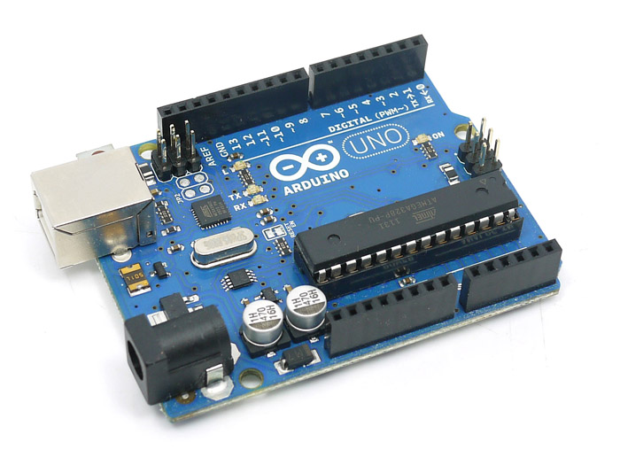
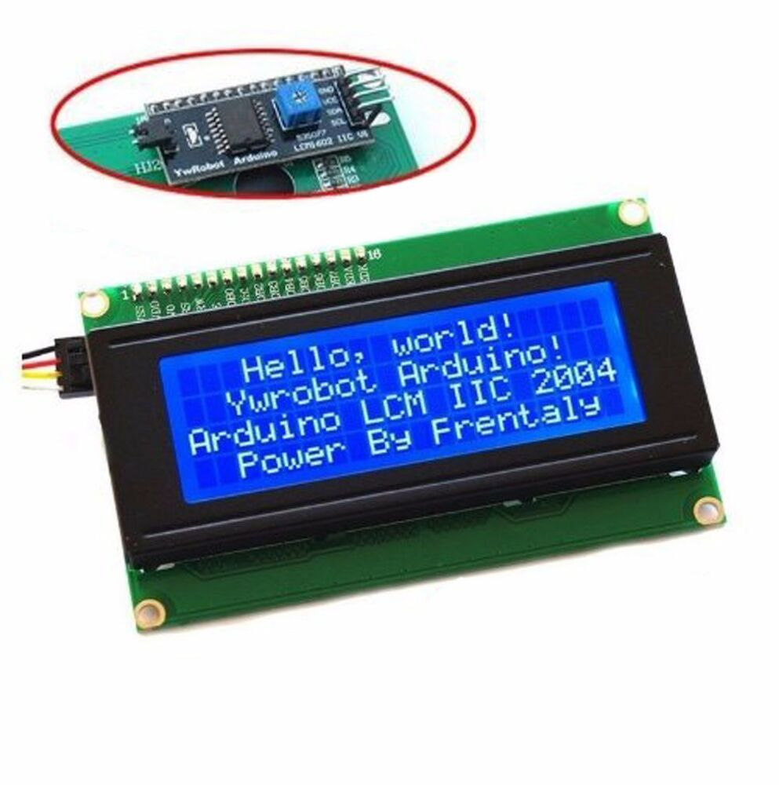
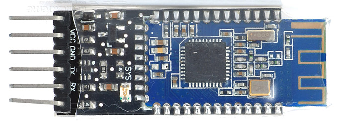
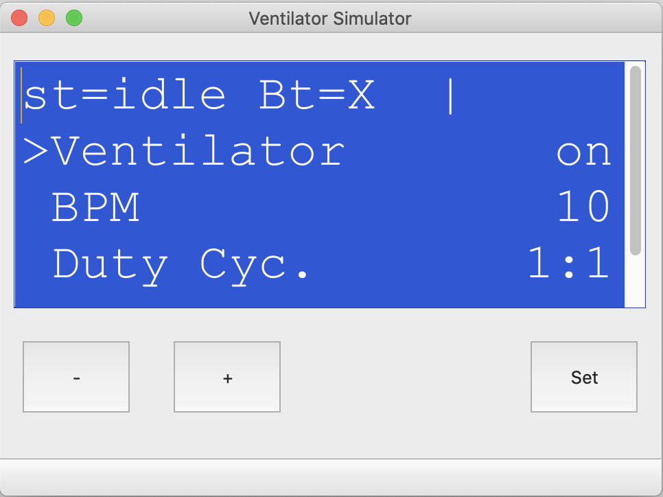

# Controller Source Code Projects

* **ArduinoVent** The final target code for the Ventilator Controller

* **VentSim** The VentSim purpose is to focus on UI and high level control of the Ventilator. Some particular files will be port to the real Ventilator project and others emulates the native Arduino libraries.

* **Android** Placeholder for Android App

* **iOS** Placeholder for iOS App

## Prototype

## Project concept
The goal of the Ventilator project is to provide ways to anyone produce a ventilator using low cost out-of-shelf components.
### Concept Video
[click here for Concept Video](https://youtu.be/OPbaNoG-sxQ)
### UI Update
[click here for UI Update Video](https://youtu.be/SgtlYgqE2HE)

### Some suggested components:

* Microcontroller (US$12)
[Amazon link](https://www.amazon.com/Emakefun-Development-Interface-Wireless-ATmega328P/dp/B07RDH8D4T/ref=sxin_0_ac_d_pm?ac_md=1-0-VW5kZXIgJDIw-ac_d_pm&cv_ct_cx=arduino+uno&keywords=arduino+uno&pd_rd_i=B07RDH8D4T&pd_rd_r=054f0126-5538-4fb4-93cc-5a2cf8431b4f&pd_rd_w=xVhNs&pd_rd_wg=rsURv&pf_rd_p=0e223c60-bcf8-4663-98f3-da892fbd4372&pf_rd_r=43RDPGY99Y567EFNAMYY&psc=1&qid=1584833975)

* LCD Module (US$12)
[Amazon link](https://www.amazon.com/ZealMax-Module-Interfaz-Arduino-MEGA2560/dp/B08181VP31/ref=sr_1_fkmr2_1?keywords=arduino+lcd+4+rows&qid=1584834089&sr=8-1-fkmr2)

* BLE Module - (US$10)
[Amazon link](https://www.amazon.com/DSD-TECH-Bluetooth-iBeacon-Arduino/dp/B06WGZB2N4/ref=redir_mobile_desktop?ie=UTF8&aaxitk=SHdRdFy9Ybn2qMCGps1Sww&hsa_cr_id=8435439580201&ref_=sb_s_sparkle)

## Controller
At this point the team building the Ventilator only needs a timer to control breath rate via two valves: inhalation/exhalation valves. Later on we will add a step motor to drive a machanism to squeese a rubber bad/bottle in order to provide positive pressure.

## UI Options
Whoever is producing the Ventilator can opt to use either a LCD + 4 Buttons physical interface or an Android device connected via Bluetooth-LE (according to their budged and components availability). Both option can also coexist fine.

## UI Initial concept/proposal

### LCD/Buttons Interface
VentSim simulates the LCD and buttons. The LCD displays the following rows:

Where the rows represent the following tokes:

 * **First Row**: St (Idle, On, or Error). Bt indicates:
   * X: Bluetooth is not installed
   * D: Bluetooth is disabled
   * A: Bluetooth is advertising
   * C: Bluetooth is connected.
   The last 6 characters on the right displays the breath progress, where "||||||" means lung full and 6 spaces empty lung. 

 * **The other rows** are scrollable and show parameters. In "Normal" mode the **"-"** and **"+"** buttons are use to scroll the parameter list. Pressing and hold the **"-"** button scrolls the list up to the top.
 To change a parameter the user needs to press and hold the **"Set"** button for half+ second; it enters in "Enter" mode; then the selected row starts flashing indicating that the parameter can be changed; the The **"-"** and **"+"** buttons increment or decrement the value; Pressing the **"Set"** button commits the change (and so if times-out) and return the unit to "Normal" mode. 

### Android UI
TBD

